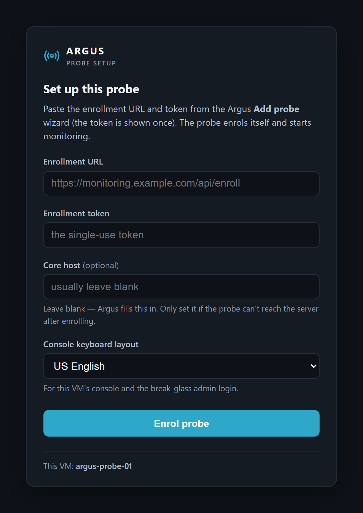

# argus-probe

The monitoring **probe** for [Argus](https://github.com/g-guglielmi/argus-core) - a self-enrolling
Zabbix active proxy, in two delivery formats that share one enrollment flow:

- **`deploy/probe-image/`** - the **Docker image** (`ghcr.io/g-guglielmi/argus-probe`). On first boot it
  generates a key + CSR, redeems a single-use enrollment token against Argus (`/api/enroll`), and runs
  the stock Zabbix proxy. Includes the opt-in self-update roles (`updater`, `recreate`).
- **`deploy/probe-vm/`** - the **self-configuring golden VM** (Packer). A Debian image that runs the
  `argus-probe` container and self-enrolls on first boot (cloud-init or a first-boot setup page).
  Published as `probe-vm/vX.Y.Z` releases (qcow2 + VHD).

The VM is a delivery wrapper around the same container - that's why they live together here.

## First-boot enrollment

On first boot the golden VM serves a setup page at its IP: paste the enrollment URL and single-use
token from the Argus **Add probe** wizard, pick the console keyboard layout, and the probe signs its
own certificate and registers itself - the private key never leaves the probe. Zero-touch enrollment
via cloud-init (a seed ISO) is also supported, in which case this page is skipped.

Screenshot uses generic placeholder data.

## Relationship to the rest of Argus

- **[argus-core](https://github.com/g-guglielmi/argus-core)** - the app (backend + UI). Mints the
  enrollment tokens, signs CSRs, and drives the probe fleet. The probe's enrollment/check-in protocol
  is a contract shared with the core.
- **[argus-updater](https://github.com/g-guglielmi/argus-updater)** - the socket-holding self-update
  sidecar for the core.

## Check-in & network discovery

The running probe reports to Argus every **60 seconds** (`POST /api/probes/checkin`, Bearer probe
token minted at enrollment): `{"version": "<zabbix>-r<n>", "scans": true, "sweeps": true}` - its
image version plus the **network-scan** and **UniFi-sweep capability** adverts. The response
carries the fleet target, the current core host (fleet re-point), and, when an Argus admin has
queued a discovery job for this probe, ONE one-shot job:

- `scan: {id, cidr, snmp, controllers}` - the entrypoint backgrounds `argus_netscan.py`
  (stdlib-only Python, baked into the image at `/usr/lib/zabbix/externalscripts/`), which sweeps
  the subnet - ICMP, a small TCP port set, SNMP v1/v2c system OIDs, an HTTP(S) banner, a real DNS
  query, reverse DNS, ARP. An 8-minute budget, at most 1024 addresses. Since r16 the optional
  `controllers` list (Argus's saved UniFi controllers) is queried locally after the scan,
  best-effort: matching hosts gain controller device facts (`unifi` + `unifi_ctl`) or a
  client-table naming hint (`unifi_client`) in the posted results.
- `sweep: {id, url, key}` - the entrypoint backgrounds `argus_unifi_sweep.py`, which asks that
  UniFi Network controller for its adopted devices (`X-API-KEY`, all sites, TLS unverified - a
  handful of HTTPS calls).

Both POST their raw facts back to `POST /api/probes/scan-results`, run one at a time per kind
(lock files), and keep the probe a pure reporter with no listening port; an older Argus that never
sends `scan`/`sweep` leaves the branches inert.

## Images & releases

- Container: `ghcr.io/g-guglielmi/argus-probe` (built by `.github/workflows/probe-image.yml`).
- Container **revisions** are also cut as GitHub Releases `probe/v<zabbix>-r<n>`, tracking the Zabbix base version (decoupled from the app's semver).
- Golden VM: GitHub Releases tagged `probe-vm/vX.Y.Z` (built by `.github/workflows/probe-vm.yml` on a
  `probe-vm/v*` tag or manual dispatch).

See `deploy/probe-vm/README.md` for building and deploying the VM.

## License

Argus is free software licensed under the **GNU Affero General Public License v3.0**
(see [`LICENSE`](LICENSE)). Source: <https://github.com/g-guglielmi/argus-probe>

Copyright (C) 2026 g-guglielmi
